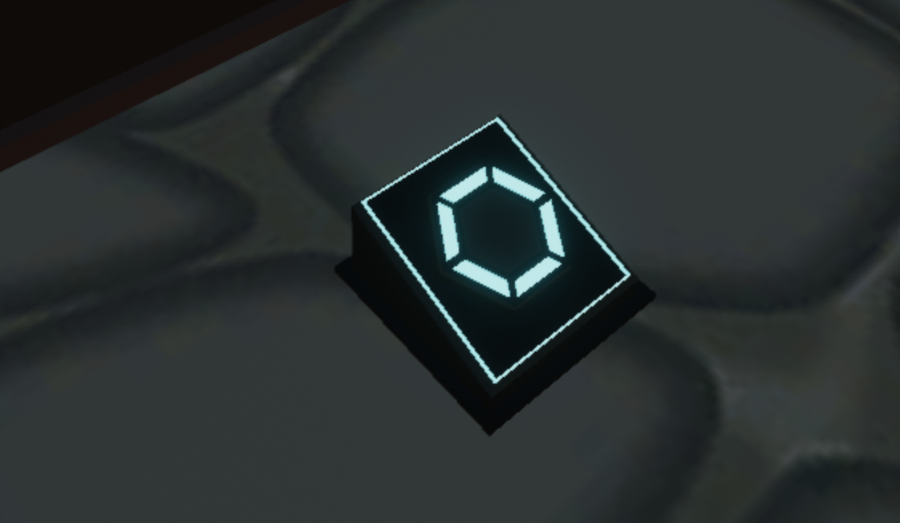

# Paid Button

A simple scene that uses the `decentraland-crypto-utils` library to make a MANA payment when a player clicks a button.

 

This scene shows you:

- How to use the crypto utils library
- How to send a payment in MANA to a wallet
- How to dealy an action itll a transaction for a payment in MANA is sent
- How to handle async functions
- How to define the elements of a scene as game objects, with state and functions
- How to open a custom UI to display a confirmation prompt
- How to make a UI component clickable and use it to trigger functions

The crypto Utils function makes it a lot simpler to perform blockchain functions. Sending MANA from one account to another just takes one line of code using this library.

Feel free to reuse the models and code from this scene!

> Note: The crtpyo-utils library is currently a work in progress and has issues that need to be resolved. It's not yet published on npm, but you can copy what's been done in the `package.json` file of this repository.

## Try it out

**Install the CLI**

Download and install the Decentraland CLI by running the following command:

```bash
npm i -g decentraland
```

**Previewing the scene**

Download this example and navigate to its directory, then run:

```
$:  dcl start
```

Any dependencies are installed and then the CLI opens the scene in a new browser tab.

Paste the following to the end of the URL in the browser window:

`&ENABLE_WEB3`
For example, if the URL is http://127.0.0.1:8000?position=0%2C0&SCENE_DEBUG_PANEL, make it http://127.0.0.1:8000?position=0%2C0&SCENE_DEBUG_PANEL&ENABLE_WEB3

> Note: When running a preview of a scene that uses one of the ethereum libraries, you must have Metamask or Dapper open and you must add this string.


Learn more about how to build your own scenes in our [documentation](https://docs.decentraland.org/) site.

If something doesn’t work, please [file an issue](https://github.com/decentraland-scenes/Awesome-Repository/issues/new).

## Scene usage

When clicking on the button, a UI screen will ask you to confirm the action. If confirmed, Metamask or your wallet of choice will prompt you to confirm the transaction. Once confirmed, the action that's linked to the lever is performed: the door will open.

You can test this scene in Ropsten testnet to aviod paying real MANA and Ether for the gas fee. To do so, simply set your Metamask network from Mainnet to Ropsten and reload the scene.

## Copyright info

This scene is protected with a standard Apache 2 licence. See the terms and conditions in the [LICENSE](/LICENSE) file.
